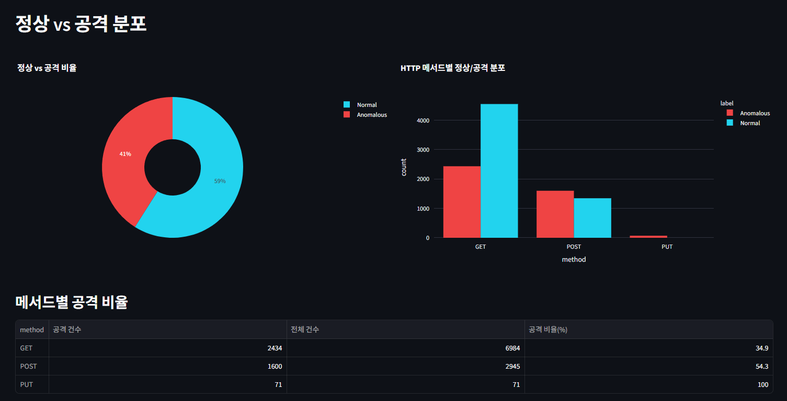
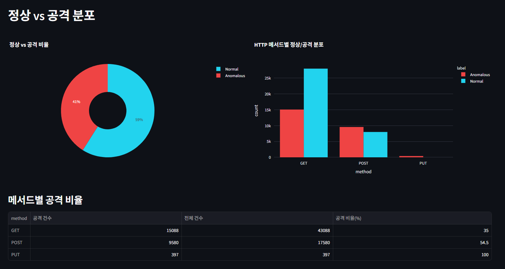
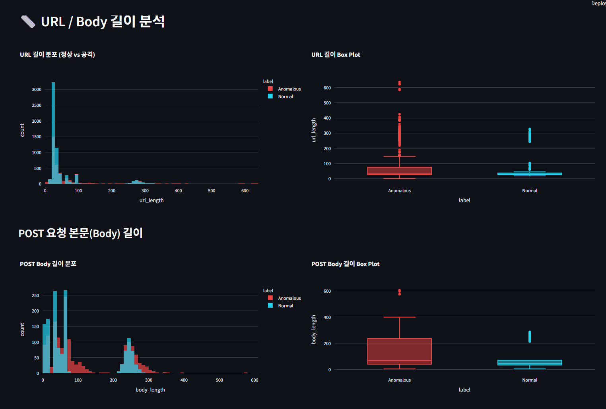
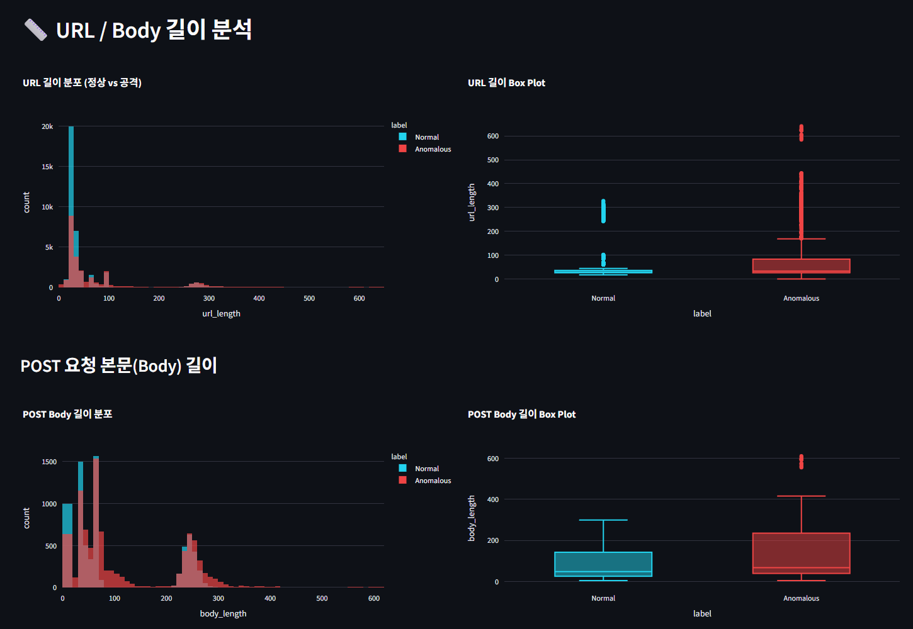
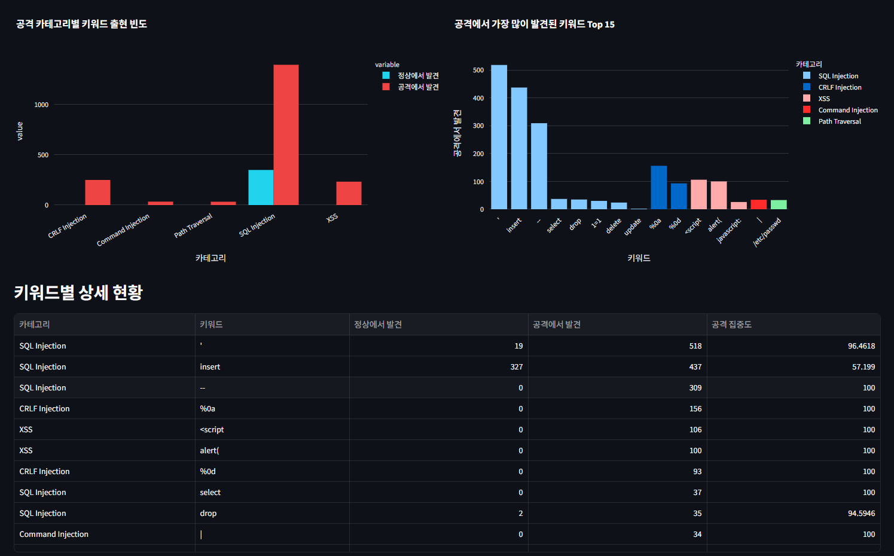
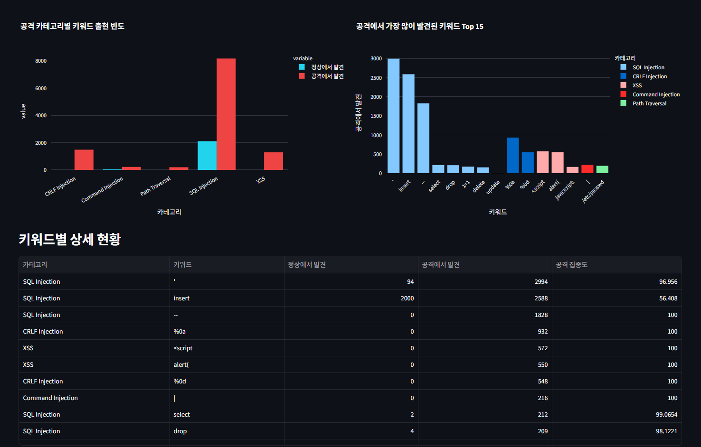
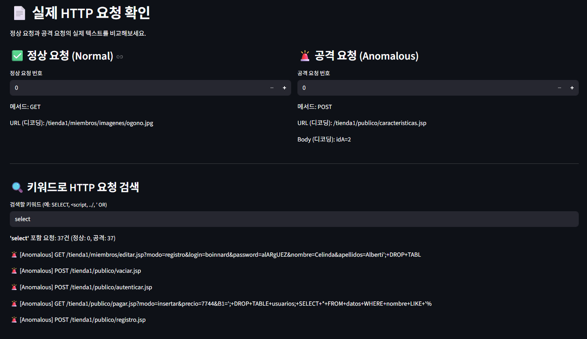
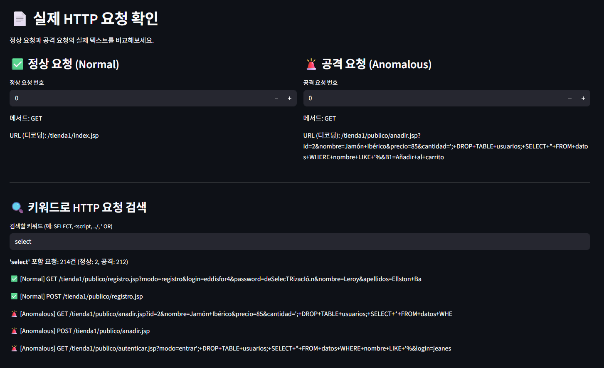

# CSIC 2010 데이터셋: 10,000건 vs 61,065건 비교 분석 보고서

## (깃허브 10_week 폴더에 .md ver 있고, images 폴더에 원본 이미지들 있음)

**과목**: 빅데이터 분석 프로젝트 2026  
**학번/이름**: 20241499 장진석  
**주제**: 동일 데이터셋의 **샘플 크기 차이**(전수 61,065건 vs 층화 축소 10,000건)가 EDA 결과에 미치는 영향 분석  
**대상 데이터**: CSIC 2010 HTTP 요청 데이터셋 (정상/공격 라벨링)

---

## 0. 보고서 개요

본 보고서는 동일한 CSIC 2010 HTTP 요청 데이터를 두 가지 크기로 분석하여 비교한다.

| 구분 | 파일 | 행 수 | 성격 |
|---|---|---:|---|
| 원본(전처리는 거침) | `csic2010_requests_61000.csv` | **61,065건** | CSIC 2010 전체 |
| 축소본 | `csic2010_requests.csv` | **10,000건** | 라벨 비중(Normal/Anomalous)을 유지하면서 **층화 축소(stratified sampling)** 한 버전 |

핵심 질문: **"원본을 약 1/6로 줄여도, EDA에서 얻는 결론은 동일하게 유지되는가?"**

결론을 먼저 말하면 — **거의 모든 분포 통계가 원본과 일치**하며, 축소본은 실습/시각화 목적에 충분하다. 다만 **고유값(unique) 종류·희소(rare) 패턴**에 대해서는 원본이 압도적으로 풍부하다.

---

## 1. 데이터 크기와 메모리

| 지표 | 10,000건 | 61,065건 | 비율 |
|---|---:|---:|---:|
| 행 수 | 10,000 | 61,065 | 1 : 6.11 |
| 열 수 | 18 | 18 | 동일 |
| 메모리 사용량 (deep) | **5.6 MB** | **33.9 MB** | 1 : 6.05 |

> **관찰**: 메모리 사용량 비율(6.05)이 행 수 비율(6.11)과 거의 일치 → 컬럼 구성·문자열 길이 분포가 두 버전에서 동질적이라는 신호.

### 1.1 컬럼 구조 (`df.info()`)

두 버전 모두 18개 컬럼·동일 스키마. 결측치가 있는 컬럼은 다음과 같다.

| 컬럼 | 10,000건 결측 | 61,065건 결측 | 의미 |
|---|---:|---:|---|
| `url` | 39 | 214 | URL 자체가 비어있는 비정상 요청 |
| `accept` | 71 | 397 | `PUT` 요청 등에서 Accept 헤더 없음 |
| `content_type` | 6,984 | 43,088 | **GET 요청** → 본문 없음 |
| `content_length` | 6,984 | 43,088 | 위와 동일 |
| `body` | 6,984 | 43,088 | 위와 동일 |

> **검증**: `df.loc[df["content_length"].isna(), "method"].value_counts()` 결과 → **결측 행은 100% GET 메서드**.  
> 즉 `content_type/content_length/body`의 결측은 데이터 손상이 아니라 **HTTP 프로토콜상 GET 요청에 본문이 없는 것**이다. 결측이 아닌 "구조적 부재(missing by design)".

---

## 2. 라벨 분포 (Normal vs Anomalous) ★

층화 축소가 제대로 되었는지 확인하는 핵심 지표.

| 라벨 | 10,000건 (count / %) | 61,065건 (count / %) |
|---|---:|---:|
| Normal | 5,895 / **59.0%** | 36,000 / **59.0%** |
| Anomalous | 4,105 / **41.0%** | 25,065 / **41.0%** |

> **결과**: 비율이 **소수점 첫째 자리까지 정확히 일치(59.0% / 41.0%)** → 층화 추출이 정상적으로 수행되었음을 확인.  
> 모델 학습 시 클래스 불균형(41:59)은 모두 동일하게 적용된다.

---

## 3. HTTP 메서드 분포

| 메서드 | 10,000건 (건수 / %) | 61,065건 (건수 / %) |
|---|---:|---:|
| GET  | 6,984 / 69.8% | 43,088 / 70.6% |
| POST | 2,945 / 29.4% | 17,580 / 28.8% |
| PUT  |    71 /  0.7% |    397 /  0.7% |

> **관찰**: GET 비율이 약 0.8%p 차이나지만 무시할 수준. PUT은 매우 희소(<1%)지만 두 버전 모두 보존되어 있다.

### 3.1 메서드 × 라벨 교차 분석

**10,000건 버전**

| method | Anomalous | Normal | 공격 비율 |
|---|---:|---:|---:|
| GET  | 2,434 | 4,550 | **34.9%** |
| POST | 1,600 | 1,345 | **54.3%** |
| PUT  |    71 |     0 | **100.0%** |

**61,065건 버전**

| method | Anomalous | Normal | 공격 비율 |
|---|---:|---:|---:|
| GET  | 15,088 | 28,000 | **35.0%** |
| POST |  9,580 |  8,000 | **54.5%** |
| PUT  |    397 |      0 | **100.0%** |

> **핵심 발견**
> 1. **GET은 절반 이상이 정상**(65%)이지만, **POST는 절반이 공격**(54%) → 본문이 있는 요청이 공격 통로로 더 자주 쓰임.
> 2. **PUT은 100% 공격** → CSIC 2010 데이터셋에서 PUT은 정상 트래픽에 존재하지 않으며, 발견 즉시 의심해야 할 시그널.
> 3. 두 버전 간 공격 비율 차이는 **최대 0.2%p** 수준 → **층화가 메서드 단위에서도 잘 유지**됨.

---

## 4. URL 길이 분석

| 구분 | 10,000건 (평균 / 중앙값 / 최대) | 61,065건 (평균 / 중앙값 / 최대) |
|---|---|---|
| Normal    | 51 / 29 / 332 | 49 / 28 / 337 |
| Anomalous | **77** / 33 / **865** | **77** / 36 / **865** |

`describe()` (`url_length` 컬럼)

| 통계 | 10,000건 | 61,065건 |
|---|---:|---:|
| count | 9,961 | 60,851 |
| mean  | 61.54 | 60.52 |
| std   | 78.10 | 75.60 |
| max   | 865 | 865 |

> **관찰**
> 1. **공격 URL의 평균 길이가 정상의 약 1.5배**(77 vs 49~51) → SQL Injection·XSS 페이로드 삽입으로 인한 부풀림.
> 2. **최댓값 865는 두 버전 동일** → 가장 긴 공격 샘플이 축소본에도 포함되었음 (꼬리 패턴 보존됨).
> 3. **표준편차(std)**: 10K에서 78.1 → 61K에서 75.6. 표본이 작을수록 분산 추정치가 살짝 부풀려지는 통계학적 현상과 일치.

---

## 5. 고유값(`nunique`) 다양성 — **여기서 두 버전이 갈린다**

| 컬럼 | 10,000건 | 61,065건 | 비율 |
|---|---:|---:|---:|
| `url` | 2,692 | **13,487** | 1 : 5.01 |
| `cookie` | 10,000 | 61,065 | 1 : 1 (모두 고유) |
| `content_length` | 273 | 382 | 1 : 1.40 |
| `body` | 2,184 | 12,091 | 1 : 5.54 |
| `label`, `method`, `host` 등 | 동일 (2, 3, 2 …) | 동일 | — |

> **핵심 발견**
> 1. **`cookie` 컬럼은 모든 행에서 고유**(JSESSIONID) → ML 학습에서는 **제거해야 할 컬럼**. 그렇지 않으면 모델이 쿠키를 그대로 외워버린다(데이터 누수).
> 2. **URL 고유값**: 행 수는 6배인데 URL 고유값은 5배 → 원본에는 축소본에 없는 **희소(rare) URL 패턴이 약 10,795개 더 존재**한다.
> 3. **모델 학습/공격 시그니처 추출**이라면 **61K가 유리**, **시각화·EDA 학습**이라면 **10K로 충분**.

---

## 6. 실제 HTTP 요청 샘플 비교

### 6.1 정상 요청 (Normal)
```
[10,000건]  GET  /tienda1/miembros/imagenes/ogono.jpg
[61,065건]  GET  /tienda1/index.jsp
```
→ 둘 다 정적 리소스/메인 페이지 접근. 평범한 요청.

### 6.2 공격 요청 (Anomalous) — 10,000건 버전의 샘플 3건

```
#1  GET  /WebSphereSamples/SingleSamples/Increment/increment.html
#2  GET  /tienda1/publico/carrito.jsp/asf-logo-wide
#3  GET  /tienda1/global/estilos.css/asf-logo-wide.gif/.Old
```

| # | 공격 유형 | 의도 |
|---|---|---|
| 1 | **Default File Probing** | IBM WebSphere 기본 샘플 경로 탐색. 운영 서버에 남아있는 알려진 취약점 악용 시도. |
| 2 | **Path Manipulation** | `.jsp` 뒤에 가짜 경로 추가 → 인증/필터 우회(Path Confusion). |
| 3 | **Backup File Access** | `.Old` 확장자 → 백업/구버전 파일에서 소스 코드 노출 시도. |

### 6.3 공격 요청 — 61,065건 버전의 샘플 3건 (URL 인코딩된 페이로드)

```
#1  GET  /tienda1/miembros/editar.jsp?modo=registro&login=chi-yin&password=zAfIo&...
#2  GET  /tienda1/publico/anadir.jsp?id=2%2F&nombre=Jam%F3n+Ib%E9rico&...
#3  GET  /tienda1/miembros/editar.jsp?modo=registro&login=teodoro&password=b9h%FA4a&...
```

> **관찰**: 61K 버전에서는 **URL 인코딩된 페이로드(`%2F`, `%F3`, `%E9` 등) 공격**이 더 자주 샘플링됨. 같은 "Anomalous" 라벨이라도 표본이 클수록 **공격 유형의 다양성이 노출**된다.

---

## 7. Streamlit 시각화 비교 (깃허브 images 폴더에 원본 이미지들)

10K 버전: `eda_visualization.py` → `streamlit run eda_visualization.py`  
61K 버전: `20241499_장진석_eda_visualization.py` → `streamlit run 20241499_장진석_eda_visualization.py`


### 7.1 분포 분석 탭 (정상 vs 공격 파이/막대)

| 10,000건 | 61,065건 |
|---|---|
|  |  |

**관찰**
- 도넛 차트 비율 **41% / 59% 완전 동일** — 층화 추출 검증 완료.
- 막대 차트의 Y축 스케일이 **10K: 0~4,000** vs **61K: 0~25k**로 약 6배 차이지만, **메서드별 정상/공격 막대 비율(높이의 상대 관계)은 동일**.
- 우측 표의 "공격 비율(%)" 컬럼도 GET 34.9 vs 35.0 / POST 54.3 vs 54.5 / PUT 100 vs 100 — 0.2%p 이내로 일치.

### 7.2 URL/Body 길이 분포 탭

| 10,000건 | 61,065건 |
|---|---|
|  |  |

**관찰**
- URL 길이 히스토그램: 두 버전 모두 **0~50 구간에 정상(시안)이 집중**되고, **200~300 구간에 공격(빨강)의 두 번째 봉우리**가 보임 → 같은 분포 형태.
- **Box Plot 비교**: 두 버전 모두 Anomalous의 박스가 Normal보다 위/넓게 위치(중앙값·IQR이 큼). 다만 **61K Box Plot에서 outlier 점들이 300~600 구간에 훨씬 빽빽** — 표본이 클수록 긴 꼬리(long-tail) 공격 페이로드가 더 풍부하게 노출됨.
- POST Body 길이도 동일 패턴(0~100 / 200~300의 이봉 분포).

### 7.3 공격 키워드 탭

| 10,000건 | 61,065건 |
|---|---|
|  |  |

**관찰**
- 카테고리별 막대 순위 동일: **SQL Injection ≫ CRLF Injection ≈ XSS > Command Injection > Path Traversal**.
- Top 15 키워드 순서도 동일: `'` > `insert` > `--` > `%0a` > `<script` > `alert(` > `%0d` …
- **희소 키워드의 절대 건수 차이가 크다**:

  | 키워드 | 10K (정상/공격) | 61K (정상/공격) |
  |---|---|---|
  | `'` | 19 / **518** | 94 / **2,994** |
  | `select` | 0 / 37 | **2** / 212 |
  | `drop` | 2 / 35 | 4 / 209 |
  | `insert` | 327 / 437 | 2,000 / 2,588 |

- **숨겨진 발견**: 10K에서는 `select`가 정상 트래픽에 **0건**이지만 61K에서는 **2건**(false positive 가능성) 등장. → 표본이 작으면 정상 트래픽의 자연 발생 키워드가 누락되어 **공격 탐지 룰을 너무 단순하게 짤 위험**이 있다.
- `insert`는 정상 비율이 의외로 높음(43% 수준) → 단순 키워드 매칭만으로는 SQLi 탐지 어려움. 페이로드 컨텍스트(`'` 직후 `insert` 등)를 봐야 함.

### 7.4 HTTP 요청 뷰어 탭

| 10,000건 | 61,065건 |
|---|---|
|  |  |

**관찰**
- `select` 검색 결과: **10K → 37건 (정상 0, 공격 37)** vs **61K → 214건 (정상 2, 공격 212)**.
- 매칭 건수 비율 37 : 214 ≈ **1 : 5.78** (행 비 1:6.11과 유사 → 균일하게 축소됨).
- 두 버전 모두 `';+DROP+TABLE+usuarios;+SELECT+*+FROM+datos+WHERE+...` 같은 **고전적 SQL Injection 페이로드**가 그대로 노출됨 → 실습용으로 두 버전 모두 충분.
- 61K에서는 **`select` 키워드가 정상 요청 2건에 자연 등장**(예: password 문자열 안에 "Select" 부분) → 키워드 기반 탐지의 한계 사례를 보여주는 좋은 교보재.

---

## 8. 결론 및 권장사항

### 8.1 요약 비교표

| 항목 | 10K가 충분 | 61K가 필요 |
|---|:---:|:---:|
| 라벨 비율 확인 | ✅ (59:41 동일) | — |
| 메서드 분포 확인 | ✅ | — |
| URL 길이 통계 | ✅ (평균·중앙값 거의 동일) | — |
| **희소 패턴 탐색** (rare URL, rare keyword) | ❌ | ✅ |
| **ML 모델 학습** (특히 텍스트 기반) | ❌ (어휘량 부족) | ✅ |
| **시각화 · 강의 데모** | ✅ (빠른 로딩) | — |
| 메모리 부담 | ✅ 5.6 MB | 33.9 MB |

### 8.2 핵심 인사이트

1. **층화 추출은 신뢰할 수 있다** — 라벨 비율(59:41), 메서드 비율, URL 길이 평균까지 1%p 이내로 일치.
2. **고유값 다양성은 줄어든다** — URL 종류는 5배, body 종류는 5.5배 차이. 모델 일반화에는 원본이 유리.
3. **`cookie`는 무조건 드롭** — 두 버전 모두 100% 고유값이므로 ML 학습 시 제거 대상.
4. **`content_type/length/body` 결측은 결측이 아니다** — GET 요청의 구조적 부재. `fillna("")` 후 사용.
5. **공격 시그널 (PUT=100% 공격, POST가 GET보다 공격 비율 1.5배 높음)** — 두 버전에서 동일하게 관찰되어 **규칙 기반 탐지의 1차 룰**로 활용 가능.


---

## 부록. 재현용 명령어

```powershell
# 가상환경 활성화
venv\Scripts\Activate.ps1

# 노트북 실행 (Jupyter)
cd 10_week
jupyter lab

# Streamlit 두 버전을 동시에 실행 (PowerShell 두 탭에서)
streamlit run eda_visualization.py                              # http://localhost:8501
streamlit run .\20241499_장진석_eda_visualization.py --server.port 8502  # http://localhost:8502
```

---
