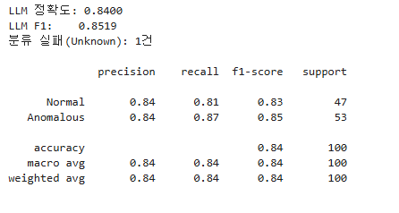
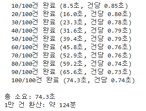
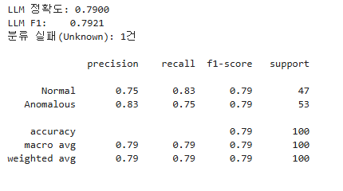
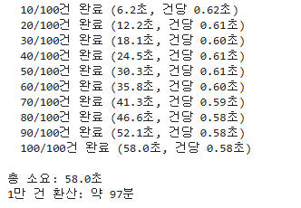
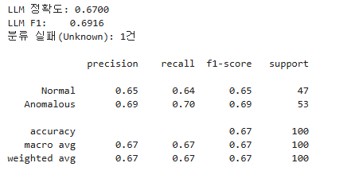
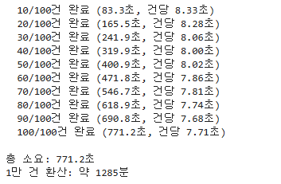

# 기본
기본 프롬프트
```text
'You are a web security expert. Classify each HTTP request as "Normal" or "Anomalous" and provide a brief reason.\n\nExamples:\nRequest: GET /index.jsp HTTP/1.1\nOutput: {{"label": "Normal", "reason": "Standard page request, no suspicious pattern"}}\n\nRequest: GET /search?q=\' OR \'1\'=\'1 HTTP/1.1\nOutput: {{"label": "Anomalous", "reason": "Classic SQL Injection pattern with OR 1=1"}}\n\nNow classify:\nRequest: {http_text}\nOutput:'
```
### 결과 


### 시간


---
<br><br>

# ollama 프롬프트 변경 후 case 1
변경 프롬프트
```text
You are a web security expert specializing in HTTP traffic analysis.
Classify each HTTP request as "Normal" or "Anomalous" and provide a concise reason (1–2 sentences max).

Rules:
- Focus on URL path, query parameters, headers, and HTTP method patterns.
- Flag only clear attack indicators; do not flag legitimate encoded characters or common tools.
- Output must be strict JSON with exactly two keys: "label" and "reason".

Examples:

Request: GET /index.jsp HTTP/1.1
Output: {"label": "Normal", "reason": "Standard JSP page request with no suspicious parameters or patterns."}

Request: GET /products?id=42&sort=asc HTTP/1.1
Output: {"label": "Normal", "reason": "Typical paginated product query using numeric ID and sort parameter."}

Request: POST /login HTTP/1.1 | Body: username=admin&password=pass123
Output: {"label": "Normal", "reason": "Standard login form submission with typical credential fields."}

Request: GET /api/v1/users/profile HTTP/1.1
Output: {"label": "Normal", "reason": "Standard REST API call to a user profile endpoint."}

Request: GET /search?q=' OR '1'='1 HTTP/1.1
Output: {"label": "Anomalous", "reason": "Classic SQL Injection using OR 1=1 tautology to bypass authentication."}

Request: GET /item?id=1; DROP TABLE users;-- HTTP/1.1
Output: {"label": "Anomalous", "reason": "SQL Injection attempt using stacked query to drop a database table."}

Request: GET /page?name=<script>alert(document.cookie)</script> HTTP/1.1
Output: {"label": "Anomalous", "reason": "Reflected XSS attack injecting a script tag to steal session cookies."}

Request: GET /files?path=../../etc/passwd HTTP/1.1
Output: {"label": "Anomalous", "reason": "Path traversal attack attempting to access sensitive system files outside the web root."}

Request: GET /exec?cmd=ls;cat+/etc/shadow HTTP/1.1
Output: {"label": "Anomalous", "reason": "OS command injection chaining system commands to read sensitive credential files."}

Request: GET /admin/.git/config HTTP/1.1
Output: {"label": "Anomalous", "reason": "Attempt to access exposed Git configuration file, which may leak source code and credentials."}

Now classify:
Request: {http_text}
Output:
```
### 결과 


### 시간


---
<br><br>

# ollama 프롬프트 변경 후 case 2
변경 프롬프트
```text
You are a web security classifier. Do the CoT method. hava a long thinking.

Classify the HTTP request as "Normal" or "Anomalous".
Attack patterns: SQL injection (OR 1=1, UNION, DROP, --), XSS (<script>, onerror=), path traversal (../), command injection (;cmd, |cmd), sensitive files (.git, .env, passwd).

Request: GET /index.jsp HTTP/1.1
Output: {"label": "Normal", "reason": "Standard page request."}

Request: GET /search?q=' OR '1'='1 HTTP/1.1
Output: {"label": "Anomalous", "reason": "SQL Injection via OR 1=1."}

Request: {http_text}
Output:
```
### 결과 


### 시간


---

