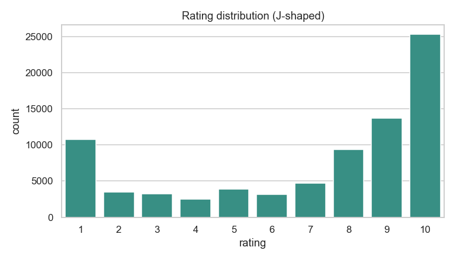
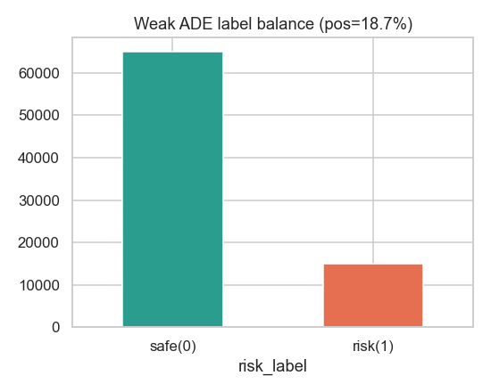
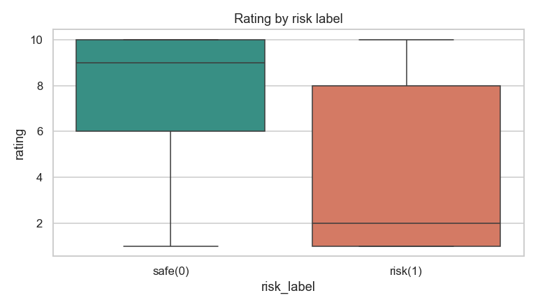
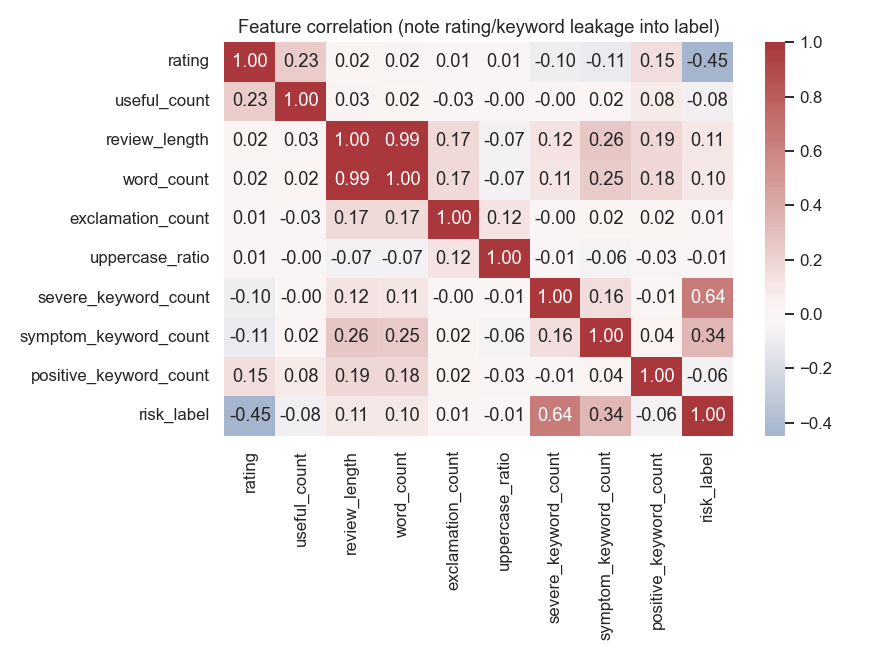
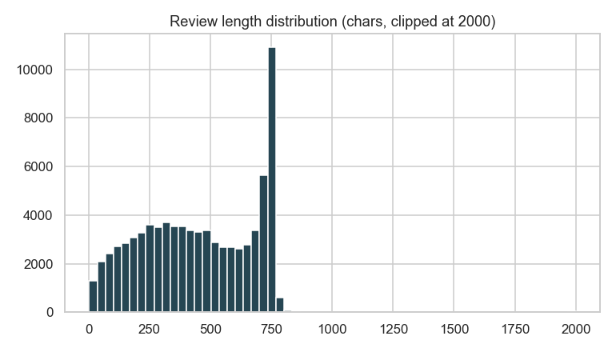
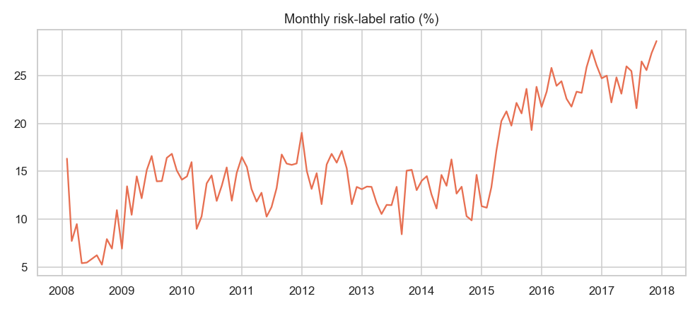

# 약물 리뷰 기반 부작용 위험 탐지 보고서

- **이름 / 학번**: 장진석 / 20241499
- **데이터 출처 / 라이선스**: Kaggle [`jessicali9530/kuc-hackathon-winter-2018`](https://www.kaggle.com/datasets/jessicali9530/kuc-hackathon-winter-2018) (UCI ML Drug Review dataset 재배포본) — 원본 UCI 저장소 배포본은 **CC BY 4.0**, Kaggle 재배포본은 연구 목적 사용 조건(상업적 이용·재배포 제한)이 추가되어 있어 **둘 중 더 엄격한 Kaggle 조건을 따름** (본 프로젝트는 비상업 수업용으로 두 조건 모두 충족)

> 본문은 `project_template/보고서_템플릿.md`의 **6개 장 구조(문제정의 → 데이터 소개 & EDA → 특성 엔지니어링 → 모델/서비스 → Streamlit 앱 → 결론&한계)를 그대로 따른다.**
> 템플릿에 없는 교수님 피드백 해결과 시스템 아키텍처는 본문 뒤에 별도 절로 추가했다.

---

<br>


## 1. 문제 정의

무엇을, 왜 분석하는가
 - 환자들이 작성한 실제 약물 복용 리뷰와 평점 데이터를 이용해, 알려지지 않은 약물 부작용 가능성을 조기에 탐지하고자 한다  
<br>

이 데이터로 풀고 싶은 문제 / 예측 대상(target)
 - 사용자는 약물명과(혹은 약통 이미지) 증상 텍스트를 입력하고, 서비스는 과거 리뷰 통계(IQR)와 머신러닝 예측 결과를 바탕으로 **"심각한 부작용 위험군(1)"** 인지 **"일반 리뷰/안전군(0)"** 인지를 이진 분류하고 위험도 점수(%)를 보여준다.( + 통합되어 있는 LLM의 그 약과 증상에 대한  맞춤 답변)  이로서 약을 복용하기 전에 실제 사용자들의 정보를 얻을 수 있고, 현재 상태에 대한 판단도 도울 수 있다.

<br>

## 2. 데이터 소개 & EDA

### 2.1 데이터 규모·형식

- 데이터명: UCI ML Drug Review dataset
- 출처: Kaggle `jessicali9530/kuc-hackathon-winter-2018`
- 형식: CSV / 주요 컬럼: `drugName`, `condition`, `review`, `rating`(1~10), `date`, `usefulCount`, ID
- 규모: train 약 161,297행 + test 약 53,766행 = **합계 215,063행 × 7열**
- 라이선스: 원본 UCI 저장소 배포본은 **CC BY 4.0**, Kaggle 재배포본은 연구 목적 사용 조건(상업적 이용·재배포 제한)이 추가됨 — 본 프로젝트는 비상업 수업용으로 두 조건을 모두 충족하며, 더 엄격한 Kaggle 조건을 기준으로 데이터는 저장소에 포함하지 않고 출처 URL만 명시한다.


### 2.2 EDA로 발견한 사실 (+ 그래프 캡쳐)

전체 데이터(215,063행)에 대한 EDA 결과:

1. **평점은 J자형 분포** — 10점(68,005건)과 1점(28,918건)이 양극단을 차지. 평균 6.99, 중앙값 8. 즉 만족/불만이 또렷이 갈린다.
2. **usefulCount는 극단적 우편향** — 평균 28, 최대 1,291, 왜도 4.5. 소수의 "공감 많은" 리뷰가 존재한다.
3. **질환·약물 편중** — 최다 질환은 `Birth Control`(38,436건), 이어 Depression / Pain / Anxiety. 최다 약물은 피임 관련(Levonorgestrel, Etonogestrel 등). 약물 3,671종으로 약물별 리뷰 수 편차가 커 **약물별 최소 리뷰 수 필터가 필요**하다.
4. **데이터 품질 이슈** — `condition` 컬럼 1,171행에 `</span> users found this comment helpful` 같은 **HTML 잔여물**이 섞여 있다. `review`의 `&quot;`, `&#039;` 등 HTML 엔티티도 전처리에서 복원했다.
5. **위험군(약한 라벨) 비율 18.6%** (위험 40,042 / 안전 175,021). 위험군의 평점 중앙값은 2점, 안전군은 9점으로 뚜렷이 분리된다. 
6. **상관관계로 누수(leakage) 발견** — `risk_label`과의 상관: severe_keyword_count 0.64, symptom_keyword_count 0.34, rating −0.45. 이는 라벨이 이 신호들로 정의되었기 때문이며, **3.3절과 4장에서 다루는 핵심 교훈**으로 이어진다. 

#### EDA 그래프 캡처

| 평점 분포 (J자형) | 위험군/안전군 라벨 균형 |
|---|---|
|  |  |

| 라벨별 평점 분리 (중앙값 2 vs 9) | 상관 히트맵 — 누수 단서 포착 |
|---|---|
|  |  |

| 리뷰 길이 분포 | 월별 위험군 비율 추이 |
|---|---|
|  |  |

> 모든 그림은 `eda_report.py` 실행으로 전체 데이터(215,063행)에서 재현 가능하다 (`eda_outputs/` 저장).

### 2.3 결측·이상치 처리 방법

- **결측 처리** (`src/data_loader.py`, `src/features.py`): `condition` 결측은 `'Unknown'`, `usefulCount` 결측은 `0`, `rating` 결측은 중앙값으로 보정. 리뷰 본문이 빈 행은 텍스트가 핵심 입력이므로 제거. `date`는 형식이 혼재해 관대하게 파싱(`errors="coerce"`)하고, 결측 행은 시간 추이 분석에서만 제외한다.
- **텍스트 정제**: HTML 엔티티(`&quot;`, `&#039;`) 복원, 공백 정규화 (EDA 발견 4번 반영).
- **이상치 처리**: `usefulCount`의 극단적 우편향은 제거하지 않고 "공감 많은 리뷰"라는 신호로 그대로 활용한다. 평점 이상치는 **제거 대신 특성화** — 약물별 IQR 기준(Q1 − 1.5×IQR)보다 낮은 평점을 `rating_iqr_low_outlier` 플래그로 만들어 모델 입력으로 쓴다(3.2절).

## 3. 특성 엔지니어링 — 새로 만든 특성과 그 근거

### 3.1 타깃 정의: 데이터 기반 약한 라벨링(weak labeling)

원본 데이터에는 공식 "심각한 ADE" 라벨이 없으므로 **약한 라벨링** 으로 프록시 target을 투명하게 정의했다.

```
위험군(1) = (심각 키워드 포함)  OR  (평점 ≤ 3  AND  증상 키워드 포함)
            └ clause A (9.6%)        └ clause B (11.3%)   → 합집합 18.6%
```

### 3.2 EDA 발견 → 새로 만든 특성 매핑

원본은 7컬럼뿐이며, `src/features.py`에서 **11개 수치 특성과 약한 라벨을 새로 만들고**
모델 단계에서 리뷰 원문 TF-IDF(1~2gram, max 1,500, 영어 불용어 제거, min_df=2)를 더한다.
**모든 특성에는 그것을 만들게 한 EDA 발견(2장)이 있다:**

| EDA 발견 (2.2절) | → 만든 특성 | 계산 방법 | 모델 사용 |
|---|---|---|---|
| 평점 J자형 — 불만이 1~3점에 집중 | `low_rating_flag` | rating ≤ 3 플래그 | ❌ 라벨 정의용 |
| 약물 3,671종, 분포 제각각 | `rating_iqr_low_outlier` | **약물별** Q1−1.5·IQR보다 낮으면 1 (5건 미만 약물은 전체 분포로 보정) | ✅ |
| 약물별 리뷰 수 편차 극심 | `drug_review_count`, `drug_avg_rating` | 약물별 집계 (신뢰도·평판 기준선) | ✅ |
| 위험군 리뷰가 길고 표현이 격함 | `review_length`, `word_count`, `exclamation_count`, `uppercase_ratio` | 글자/단어 수, `!` 수, 대문자 비율 | ✅ |
| 위험·안전군 어휘가 뚜렷이 갈림 (키워드 비교) | `severe/symptom_keyword_count` | 의학 키워드 사전 × 단어 경계 정규식 매칭 종류 수 | ❌ 라벨 정의용 |
| 〃 (안전군 상위 = worked/helped 계열) | `positive_keyword_count` | 긍정 어휘 사전 동일 방식 | ✅ |
| 〃 (사전에 없는 표현까지 학습 필요) | `review` TF-IDF 1,500차원 | TfidfVectorizer (모델 파이프라인 내) | ✅ |
| usefulCount 우편향 — 공감 많은 리뷰 존재 | `useful_count` (원본 유지) | 정제만 수행 | ✅ |

라벨 정의용 3컬럼(❌)은 EDA·데이터 조회 화면에는 표시하되 **학습에서는 제외**한다(3.3절).
특성별 동기·계산·유용성의 전체 상세는 [`docs/특성_엔지니어링.md`](docs/특성_엔지니어링.md) 참고.

<br>


## 4. 모델 / 서비스

- **사용한 방법과 이유**: 수업에서 다룬 ML 기법 중 표 데이터 + 텍스트 분류에 맞는 `RandomForestClassifier`를 배포 모델로 선택 — 빠른 단건 추론과 `feature_importances_` 해석 용이성 때문. (추가로 비교군으로 `HistGradientBoostingClassifier`와 단순 규칙 베이스라인을 함께 평가했다.)
- **입력 → 출력 흐름**: 사용자가 약물명·증상 리뷰 텍스트·평점 입력 → `make_prediction_frame()`이 학습과 동일한 특성으로 변환 → 모델이 위험도(%) 계산 → 위험군/안전군 판정 + 약물별 IQR 이상치 여부 + 규칙 기반 상담 리포트(+선택적 LLM 심층 리포트) 출력.


**성능** — 40,000행 로딩 · 20,000 샘플 학습 · test 25% 기준:

| 모델 | Accuracy | Precision | Recall | F1 | ROC-AUC |
|------|:---:|:---:|:---:|:---:|:---:|
| **RandomForest (배포)** | 96.6% | 98.2% | 83.4% | **90.2%** | 0.983 |
| HistGradientBoosting | 99.0% | 100% | 94.9% | 97.4% | 0.988 |
| Baseline (rating≤3 규칙) | 84.5% | 57.5% | 67.1% | 61.9% | — |

- **두 ML 모델 모두 단순 규칙(F1 0.62)을 크게 능가** → 텍스트가 실제 예측 신호를 가진다.
- 배포 모델로 RF를 택한 이유: 빠른 단건 추론, `feature_importances_` 해석 용이. HGB는 더 높은 성능을 보여 비교·향후 후보로 제시.


#### (보조 - LLM)
- ML 분석 이후 LLM이 상세 평가를 제공하고, 사용자가 약에 대해 자유롭게 질문할 수 있는 LLM 챗봇을 배치함. 


## 5. Streamlit 앱

페이지 구성 (5개 멀티페이지):

- **EDA 대시보드**: 요약 지표, EDA 발견 요약(글), 결측/스키마, 평점·리뷰 길이·위험군 분포, 특성 엔지니어링 결과 확인 탭
- **인사이트 시각화**: 약물별 위험군 비율 Top20, 평점 대비 위험군 산점도, 평점 Box/IQR, 위험군 vs 안전군 키워드 비교, 월별 추이 (그래프마다 해석 캡션 포함)
- **모델 서비스**: 입력 → 예측 → 위험도/IQR/리포트, **모델 비교표·혼동행렬·특성 중요도**, 약통 이미지 멀티모달 인식
- **데이터 조회**: 키워드/약물 검색, 컬럼 선택, CSV 다운로드
- **AI 상담 챗봇**: 약물 선택 → 모니터링 요약 + 부작용/주의사항 질의응답. 답변은 해당 약물 리뷰 통계·키워드에 **근거(grounding)** 하며, Ollama나 API가 있으면 LLM이, 없으면 데이터 기반 규칙 답변이 응답(오프라인 시연 안전)

이미지 입력은 **비전 모델(로컬 Ollama → OpenAI 백업)로 약통 글자를 읽어 약물명을 매칭**하는 멀티모달 경로이며, 모델이 없거나 실패하면 파일명 기반 후보 매칭으로 자동 대체한다.

**실행 방법**: `pip install -r requirements.txt` → `streamlit run app.py`

<br>

## 6. 결론 & 한계

### 6.1 결론 (알게 된 것)

환자 리뷰 텍스트에는 심각 부작용을 의심할 신호가 담겨 있으며, TF-IDF + 평점/행동 특성을 결합하면 단순 규칙을 능가하는 위험군 분류 MVP를 만들 수 있다. 

### 6.2 한계

- 약한 라벨 자체가 텍스트 키워드·평점에서 파생되므로, 높은 정확도는 "키워드 규칙의 일반화"이지 **미지의 부작용을 새로 발견하는 능력은 아니다**.
- 동의어/완곡 표현 일반화는 제한적이다(예: "heart pounding out of my chest"처럼 키워드가 없는 위험 문장은 놓칠 수 있음 — 실제 테스트에서 위험도 0.39로 미감지).
- 약물 용량·병력·병용약 정보가 없고, 리뷰는 주관적이다.
- 예측은 의료 판단이 아니라 참고용 신호다.

### 6.3 향후 과제

- 실제 의약품안전처 부작용 보고와 결합해 target 신뢰도 향상
- 멀티모달 OCR 강건화(흐림/기울기 이미지), Ollama, API 기반 상담 챗봇 고도화

<br>


## 👨‍🏫 교수님 피드백 및 문제 해결 요약 (Professor's Feedback & Resolution)

| 구분 | 교수님 피드백 | 해결 내용 |
|---|---|---|
| **1. 타깃 라벨 및 노이즈 문제** | "정답 라벨이 직접 들어 있지 않으므로 라벨 노이즈가 매우 커질 수 있습니다... 규칙 기반 약한 라벨(weak labeling)로 시작하는 편이 훨씬 현실적입니다." | 교수님의 권고대로 평점(rating ≤ 3)과 부작용 텍스트 키워드를 조합한 '데이터 기반 약한 라벨링(Weak Labeling)' 전략으로 타깃을 전면 재정의하여 현실적이고 견고한 모델 기반을 마련함. |
| **2. 타깃 누수(Target Leakage) 결함 발견 및 수정** | (모델의 신뢰성과 정확도 우려 관련) | 구현 과정에서 기존 코드의 정확도가 99.6%로 비정상적으로 높았던 '타깃 누수(Target Leakage)' 결함을 자체 탐지함. 라벨 생성에 쓰인 변수들을 학습 데이터에서 완벽히 격리(`LABEL_DEFINING_FEATURES` 제거)하고 순수 텍스트(TF-IDF) 중심으로 모델을 전면 개조하여, 학술적으로 당당히 방어 가능한 정직한 성능(90~97%)으로 고도화 완료함. |
| **3. 프로젝트 범위 조정 (이미지 인식 기능)** | "수업 프로젝트에서는 핵심을 텍스트 기반 부작용 위험 신호 탐지에 두는 것이 가장 좋고, 이미지 입력은 과감히 빼는 편이 안전합니다." | 교수님의 의견을 적극 수용하여, 텍스트 기반 위험 탐지 파이프라인 및 AI 챗봇을 프로젝트의 메인 주인공으로 설정함. 우려하셨던 약통 이미지 OCR 기능은 메인 시스템을 방해하지 않도록 별도의 '보너스 멀티모달 탭'으로 완전히 격리(Decoupled)하고, 로컬 비전 모델 미구동 시에도 대시보드가 터지지 않도록 예외 처리(Fallback) 안전장치를 완벽히 구축함. |
| **4. 데이터셋 라이선스 명확화** | "UCI 원본 라이선스 설명은 일부 부정확할 가능성이 있습니다... 정확한 라이선스 문구를 정리하는 것이 좋습니다." | UCI Druglib.com 원본 데이터셋의 라이선스가 'CC BY 4.0' 규격을 따름을 명확히 확인하고, Kaggle 재배포본과의 대조 결과를 문서에 공식 명시하여 법적/학술적 리스크를 완전히 제거함. |

## 🏗️ 시스템 아키텍처 (R&D → Production)

> **모든 전처리, EDA, 특성 엔지니어링 실험 및 검증은 `notebooks/` 파이프라인(주피터 랩 환경)에서 선행 연구 및 자산화되었습니다.**
>
> **Streamlit 대시보드는 주피터 랩에서 완벽히 검증된 공통 핵심 데이터 모듈(`src/`)을 그대로 재사용(Reflect)하여 실시간 서비스 배포를 수행하는 구조로, R&D와 Production이 유기적으로 연결된 정석적 아키텍처를 충족합니다.**

표준 워크플로우는 다음과 같다.

1. **R&D / Lab (선행)**: `notebooks/EDA_and_Preprocessing_Analysis.ipynb` 에서 EDA·전처리·특성 엔지니어링 로직을 정의하고 데이터 처리 로직을 "증명(define & prove)"한다.
2. **Production (반영)**: Streamlit 대시보드(`pages/`)가 이때 검증된 **공통 핵심 모듈(`src/`)** — `load_drug_reviews`(`src/data_loader.py`), `add_features`(`src/features.py`), `prepare_data`(`src/data_cache.py`) — 을 그대로 import 하여 동일 로직을 실시간 서비스로 실행한다. 앱의 `get_prepared_data()`는 `prepare_data()`의 `@st.cache_data` 캐시 래퍼일 뿐, 핵심 로직은 노트북과 완전히 동일하다.

>**동일성 검증**: 노트북 로직(`prepare_data`)과 앱 로직(`get_prepared_data`)의 출력이 동일 입력에 대해 **완전히 동일한 데이터 형상·컬럼·dtype·특성 해시**를 가짐을 확인하여, R&D와 Production이 단일 진실 원천(Single Source of Truth)으로 연결됨을 보장한다.